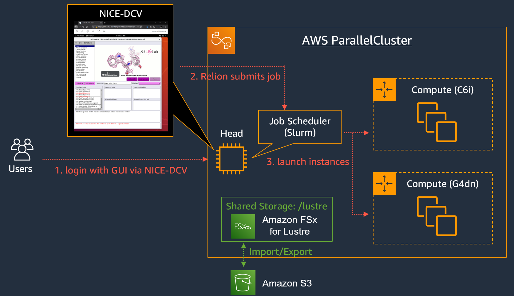
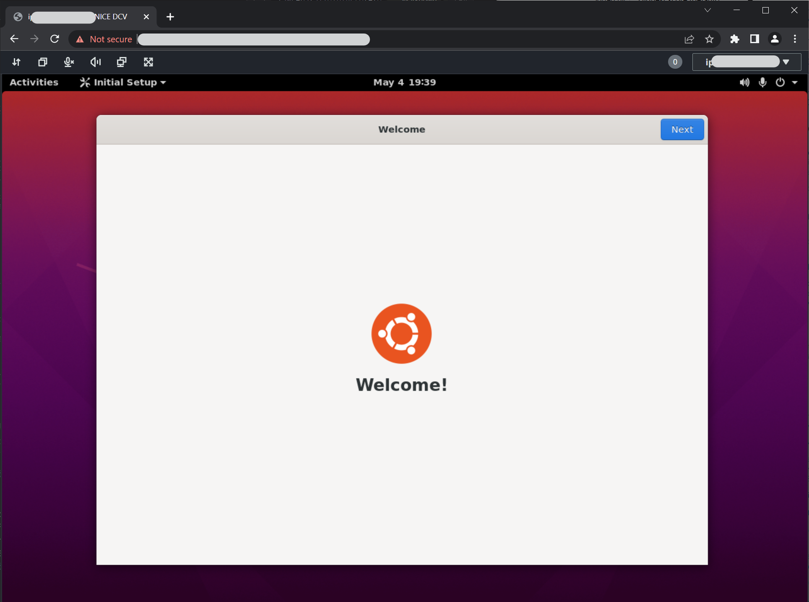
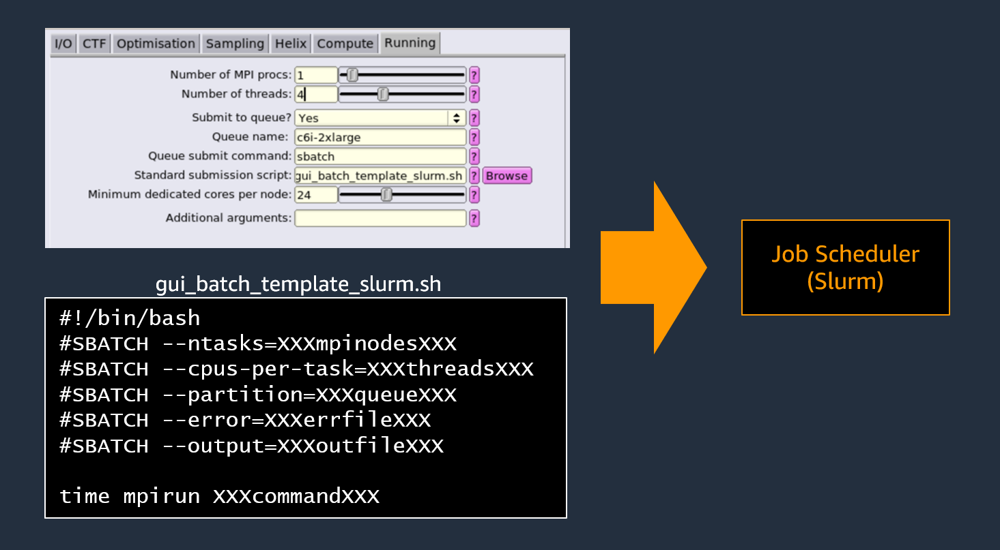

# aws-parallelcluster-relion

set up example for Relion on AWS ParallelCluster

- AWS ParallelCluster 3.1.3
- Relion 3.1.3

## Architecture Overview



- :warning: **This tutorial environment does not include FSx for Lustre / S3 integration**


## Tutorial

### 1. launch cluster

On AWS CloudShell, run following commands for cluster creation.

```
git clone https://github.com/DaisukeMiyamoto/aws-parallelcluster-relion
cd aws-parallelcluster-relion/01_setup_cluster
./create_relion_cluster.sh
source ~/.bashrc
```

You could check cluster status with following command.
Cluster creation usually needs 5 to 10 minutes.
If the `clusterStatus` become `CREATE_COMPLETE`, you could go to next step.

```
pcluster describe-cluster --cluster-name ${PCLUSTER_CLUSTER_NAME}
```


### 2. Run Relion with GUI via NICE-DCV

#### 2.1 Login ParallelCluster via NICE-DCV

Run following command and open published URL to access NICE-DCV remote desktop environment.

```
pcluster dcv-connect --cluster-name ${PCLUSTER_CLUSTER_NAME} --key-path ~/.ssh/${SSH_KEY}
```

- If it is your first time to access the cluster, a message like `The authenticity of host '54.158.195.212 (54.158.195.212)' can't be established.` could be shown.
You need to type `yes` and hitting enter.
- On opening the NICE-DCV URL with browser, you will face `Your connection is not private` warning e.g. [image](images/chrome_warning.png).
You need to click `Advanced` and `Proceed to <IP> (unsafe)` to open NICE-DCV desktop.

#### 2.2 Install Relion



On NICE-DCV desktop, open **terminal** from Activities button on top-left corner.
Run following commands on the terminal for installing Relion.

```
cd /shared
git clone https://github.com/DaisukeMiyamoto/aws-parallelcluster-relion
cd aws-parallelcluster-relion/02_relion_gui
./setup_relion_v31_gui.sh
source ~/.bashrc
```


- :warning: **This compilation settings are not optimized. You need to customize for appropriate benchmarkings.**


#### 2.3 Use public data for demonstration

Download datasets and launch Relion.
- :warning: This step downloads large amount of data (7GB) from Osaka University. Please read guides for appropriate use.
  - http://www.protein.osaka-u.ac.jp/rcsfp/databases/members/kawabata/EMtutorial.html


```
cd /shared
wget http://www.protein.osaka-u.ac.jp/rcsfp/databases/members/kawabata/EMtutorial/EMPIAR-10248/EMPIAR-10248_tutorial_precalculated_results.tar.gz
tar xvf EMPIAR-10248_tutorial_precalculated_results.tar.gz
cd EMPIAR-10248_tutorial
relion &
```

<!--
```
cd /shared
wget ftp://ftp.mrc-lmb.cam.ac.uk/pub/scheres/relion31_tutorial_precalculated_results.tar.gz
tar xvf relion31_tutorial_precalculated_results.tar.gz
cd PrecalculatedResults
relion &
```
-->

This dataset include all completed steps and intermediate files.
You could run any process without input parameter settings.
In this tutorial we will run **MotionCorr** process with batch job submission way.

1. Click `002:MotionCorr/job002/` in `Finished jobs` window to re-load MotionCorr settings.
2. Click `2D classification` in top-left corner to create a new settings.
3. Open `Compute` tab and set following parameters:
    - Use GPU acceleration?: No
4. Open `Running` tab and set following parameters:
  - [Running] Tab
    - Number of MPI procs: 1
    - Number of threads: 8
    - Submit to queue?: Yes
    - Queue name: c6i-2xlarge
    - Queue submit command: sbatch
    - Standard submission script: `/shared/aws-parallelcluster-relion/02_relion_gui/gui_batch_template_slurm.sh`
5. Click `Run!` button to submit a new job.
6. This job takes arround 10 minutes.


- This figure show how relion job submission works with GUI and template files.
Relion GUI replace parameters (e.g. `XXXmpinodesXXX` ) with GUI settings.



After job submission, you could find new EC2 instance is launching on EC2 management console.
You could also find your job status with `squeue` command.
When the instance launched, you could check the job progress with output box on Relion [image](images/relion_outputs.png).


### benchmark Relion with compile optimization

TBU

### Clean up Environments

TBU

```
pcluster delete-cluster -n ${PCLUSTER_CLUSTER_NAME}
aws s3 rm s3://${BUCKET_NAME} --recursive
aws s3 rb s3://${BUCKET_NAME}
aws ec2 delete-key-pair --key-name ${SSH_KEY}
```
