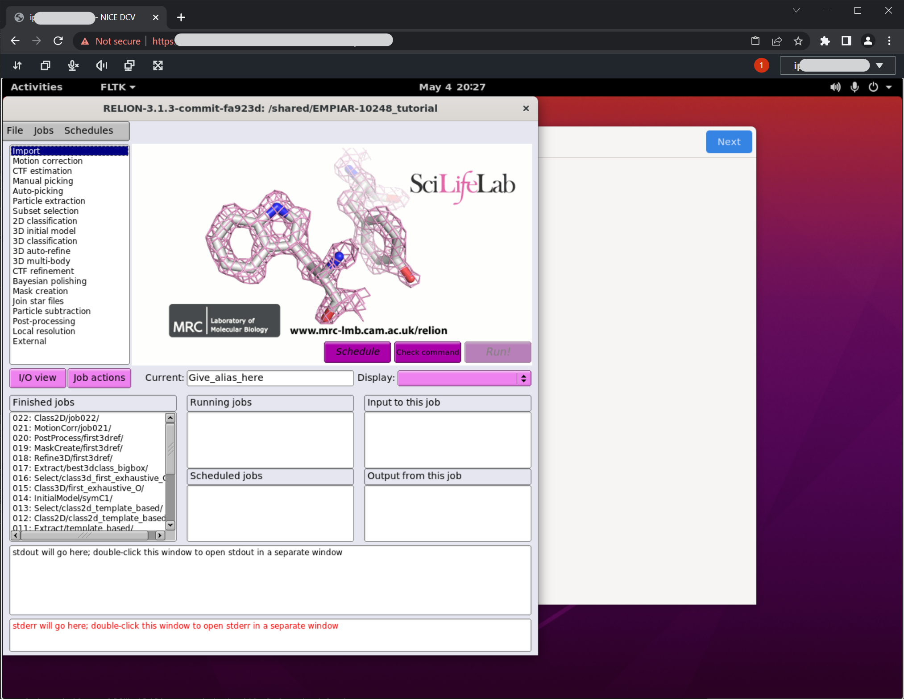

# aws-parallelcluster-relion

set up example for Relion on AWS ParallelCluster

- AWS ParallelCluster 3.1.3
- Relion 3.1.3

## Architecture Overview


- :warning: **This tutorial environment does not include FSx for Lustre / S3 integration**


## Tutorial

### 1. Launch Cluster

On AWS CloudShell, run following commands for cluster creation.

```
git clone https://github.com/DaisukeMiyamoto/aws-parallelcluster-relion
cd aws-parallelcluster-relion/01_setup_cluster
./create_relion_cluster.sh
source ~/.bashrc
```

You could check cluster status with following command.
Cluster creation usually needs 5 to 10 minutes.
If the `clusterStatus` become `CREATE_COMPLETE` from `CREATE_IN_PROGRESS`, go to next step.

```
pcluster list-clusters
```


### 2. Run Relion with GUI via NICE-DCV

#### 2.1 Login ParallelCluster via NICE-DCV

Run following command and open published URL to access NICE-DCV remote desktop environment.

```
pcluster dcv-connect --cluster-name ${PCLUSTER_CLUSTER_NAME} --key-path ~/.ssh/${SSH_KEY}
```

- If it is your first time to access the cluster, a message like `The authenticity of host '123.123.123.123 (123.123.123.123)' can't be established.` could be shown.
You need to type `yes` and hitting enter.
- On opening the NICE-DCV URL with browser, you will face `Your connection is not private` warning e.g. [image](images/chrome_warning.png).
You need to click `Advanced` and `Proceed to <IP> (unsafe)` to open NICE-DCV desktop.

#### 2.2 Compile and Install Relion


On NICE-DCV desktop, open **terminal** from Activities button on top-left corner.
Run following commands on the terminal for installing Relion.

```
cd /shared
git clone https://github.com/DaisukeMiyamoto/aws-parallelcluster-relion
cd aws-parallelcluster-relion/02_relion_gui
chmod +x ./setup_relion_v31_gui.sh
./setup_relion_v31_gui.sh
source ~/.bashrc
```

- :warning: **This compilation settings are not optimized. You need to customize for appropriate benchmarkings.**


#### 2.3 Use public data for demonstration

Run following commands to download datasets and launch Relion.
This dataset include all completed steps and intermediate files.
You could run any process without input parameter settings.
Compilation needs few minutes.

- :warning: This step downloads large amount of data (7GB) from Osaka University. Please read guides for appropriate use.
  - http://www.protein.osaka-u.ac.jp/rcsfp/databases/members/kawabata/EMtutorial.html


```
cd /shared
wget http://www.protein.osaka-u.ac.jp/rcsfp/databases/members/kawabata/EMtutorial/EMPIAR-10248/EMPIAR-10248_tutorial_precalculated_results.tar.gz
tar xvf EMPIAR-10248_tutorial_precalculated_results.tar.gz
cd EMPIAR-10248_tutorial
relion &
```

<!--
```
cd /shared
wget ftp://ftp.mrc-lmb.cam.ac.uk/pub/scheres/relion31_tutorial_precalculated_results.tar.gz
tar xvf relion31_tutorial_precalculated_results.tar.gz
cd PrecalculatedResults
relion &
```
-->



#### 2.4 Run Class2D on batch job

You could submit a job to job scheduler with `Running` tab settings.
This tutorial shows an example about running **Class2D** process with batch job  way.

1. Click `007:Class2D/ManuManuPick/` in `Finished jobs` window to re-load previous settings.
2. Click `2D classification` in top-left corner to create a new settings.
3. Open `Compute` tab and set following parameters:
    - Use GPU acceleration?: No
4. Open `Running` tab and set following parameters:
  - [Running] Tab
    - Number of MPI procs: 1
    - Number of threads: 16
    - Submit to queue?: Yes
    - Queue name: c6i-4xlarge
    - Queue submit command: sbatch
    - Standard submission script: `/shared/aws-parallelcluster-relion/02_relion_gui/gui_batch_template_slurm.sh`
5. Click `Run!` button to submit a new job.
  - After job submission, you could find new EC2 instance is launching on EC2 management console.
  - You could also find your job status with `squeue` command. Usually, launching instance needs almost 4 minutes. 
  - When the job started, `ST` (STATUS) become `R` (RUNNING) from `CF` in `squeue` command. You could also check the job progress with output box on Relion [image](images/relion_outputs.png).
6. This job takes arround 10 minutes.


- This figure show how relion job submission works with GUI and template files.
Relion GUI replace parameters (e.g. `XXXmpinodesXXX` ) with GUI settings.


### benchmark Relion with compile optimization

TBU

### Clean up Environments

TBU

```
pcluster delete-cluster -n ${PCLUSTER_CLUSTER_NAME}
```
<!--
```
aws s3 rm s3://${BUCKET_NAME} --recursive
aws s3 rb s3://${BUCKET_NAME}
aws ec2 delete-key-pair --key-name ${SSH_KEY}
```
-->

## Reference
- [AWS ParallelCluster3 Tutorial](https://catalog.us-east-1.prod.workshops.aws/workshops/6735ed89-c2de-4180-904c-40ac9fba7419/en-US/)